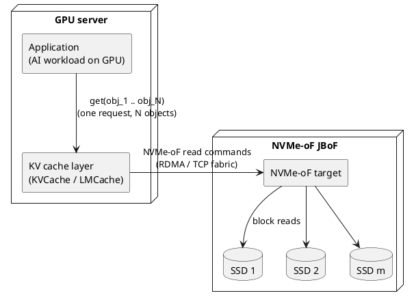
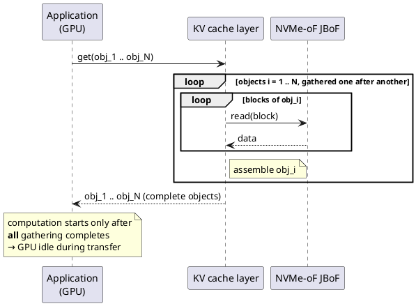
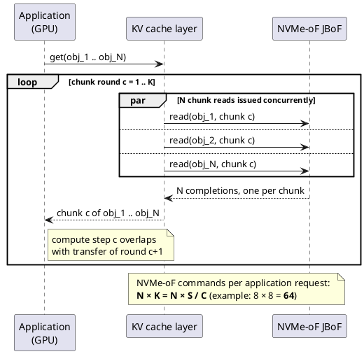
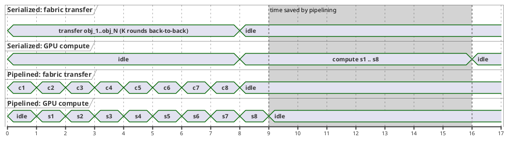
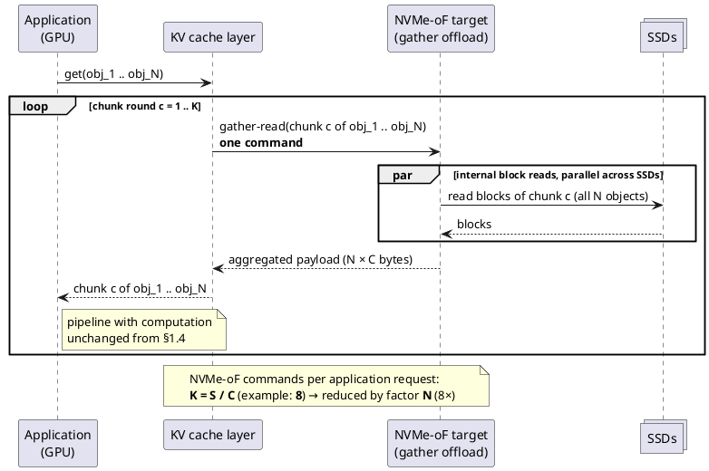

# kvopt — High-Level Design

## §1 Background

### 1.1 System context

Three participants cooperate to serve data to an AI workload:

- **Application** — the AI workload running on GPU (e.g., LLM inference). It consumes
  *objects* (e.g., KV cache entries). Because the workload is highly parallel
  (batched requests, many concurrent sequences), a single application request
  typically names **multiple objects at once**.
- **KV cache layer (KVCache / LMCache)** — manages data movement on behalf of the
  application. Today it locates the data blocks that make up each requested object,
  reads them from the JBoF over NVMe-oF, assembles complete objects, and returns
  them to the application.
- **NVMe-oF JBoF** — a disaggregated flash enclosure holding the actual data
  blocks, reached over an NVMe-oF fabric (RDMA or TCP).

### 1.2 Terminology and working parameters

| Symbol | Meaning | Running example |
|--------|---------|-----------------|
| `N` | objects named in one application request | 8 |
| `S` | object size | 1 MiB |
| `C` | chunk size — the amount of data one computation step consumes | 128 KiB |
| `K = S / C` | chunks per object | 8 |
| block | unit in which object data is stored on / read from the JBoF SSDs | — |

One computation *step* in the application operates on one chunk (`C`) of each
object. A *chunk round* `c` means "chunk index `c` of every requested object",
i.e., `N × C` bytes in total.

### 1.3 The problem: serialized gathering stalls the GPU

When the cache layer's gathering process is serialized, the application cannot
start computing until objects have been fully assembled. The fabric transfer and
the GPU computation run back-to-back instead of overlapping, and the GPU idles
for the entire transfer phase.

### 1.4 Prior art: parallel-partial read

A previous study addresses the stall by pipelining transfer and computation at
**chunk granularity**. Since one computation step needs only `C = 128 KiB` of
each `S = 1 MiB` object, the cache layer does not wait for complete objects.
Instead, per chunk round it collects chunk `c` of **every** requested object and
returns those `N` partial objects to the application in a row. The application
runs computation step `c` while the cache layer is already transferring chunk
round `c + 1`.

With transfer time and compute time per round roughly balanced, pipelining hides
most of the transfer behind computation:

(Time axis in units of one chunk round; `sX` = computation step `X` on chunk
round `X`. Idealized: transfer of one round ≈ compute of one step.)

#### Remaining cost: command amplification at the cache layer

The pipelining win is paid for in NVMe-oF command count. Reading in `C`-sized
pieces means the cache layer issues

> `N × S / C` read commands per application request — **64** in the running
> example, versus 8 full-object reads.

This amplification hurts in several ways:

- **Per-command overhead on the cache-layer CPU** — submission, completion
  handling, and the gathering/assembly bookkeeping all scale with command count.
- **Fabric round trips** — each 128 KiB read is a separate NVMe-oF exchange;
  per-command overheads are a larger fraction of small transfers.
- **Queue pressure** — sustaining the pipeline across many concurrent
  application requests multiplies outstanding commands.
- The gathering logic itself — deciding which blocks form chunk `c` of each
  object and stitching completions together — still runs entirely on the cache
  layer, on the critical path of every round.

### 1.5 This work: offload the gather to the JBoF

The core idea of this design is to **move the gathering process into the
NVMe-oF JBoF**. Instead of issuing `N` separate chunk reads per round, the cache
layer issues **one gather-read command per chunk round** that names chunk `c` of
all `N` objects. The JBoF resolves the underlying blocks itself, reads them in
parallel across its SSDs, and returns a single aggregated payload of `N × C`
bytes.

The application-facing behavior — partial objects delivered per chunk round,
computation pipelined against transfer — is unchanged from the prior art. What
changes is where the gather runs and how much command traffic crosses the
fabric:

| Approach | NVMe-oF commands per request | Example (`N=8, S=1 MiB, C=128 KiB`) | GPU / transfer overlap |
|----------|------------------------------|--------------------------------------|------------------------|
| Full-object serialized gather | ~`N` object reads (block reads serialized) | 8 | none — GPU stalls |
| Parallel-partial read (prior art) | `N × S / C` | 64 | yes |
| **JBoF-offloaded gather (this work)** | `S / C` | **8** | yes |

Beyond the raw command-count reduction (`N × S / C → S / C`, i.e., a factor of
`N`), the offload removes the per-round gathering logic from the cache-layer
CPU and lets block-level parallelism be exploited where the SSDs actually are —
inside the JBoF.

### 1.6 Scope of this design (draft)

In scope:

- Semantics of the gather-read command between the cache layer and the JBoF
  (addressing, chunk-round description, completion/ordering guarantees).
- JBoF-side gather engine: resolving objects to blocks, parallel SSD reads,
  payload aggregation.
- Integration with the KV cache layer (KVCache / LMCache) read path.

Out of scope (assumed unchanged):

- Application/GPU-side computation and its chunk-granular consumption model.
- Cache admission/eviction policy and object placement policy on the JBoF.

### 1.7 Open questions

1. **Where does the gather engine run?** NVMe-oF target software (e.g., an
   SPDK-based target), a DPU on the JBoF, or SSD-internal capability?
   → *§2.1: the virtualized NVMe-oF target of the JBoF.*
2. **Command transport** — a gather-read is not a standard NVMe I/O command.
   Vendor-specific command, NVMe Key-Value, or a thin object protocol above
   NVMe-oF?
   → *§2.2/§2.4: standard NVMe cross-namespace Copy + Read; fused Copy+Read as
   a spec proposal.*
3. **Object-to-block mapping** — does the JBoF already know object layout, or
   must the cache layer ship a block list inside the gather-read command?
   → *§2.2: the cache layer ships the resolved source-range list in the Copy
   command; the JBoF holds no object metadata.*
4. Failure/partial-completion semantics when one SSD read of a round is slow or
   fails. → *carried into §2.8.*
