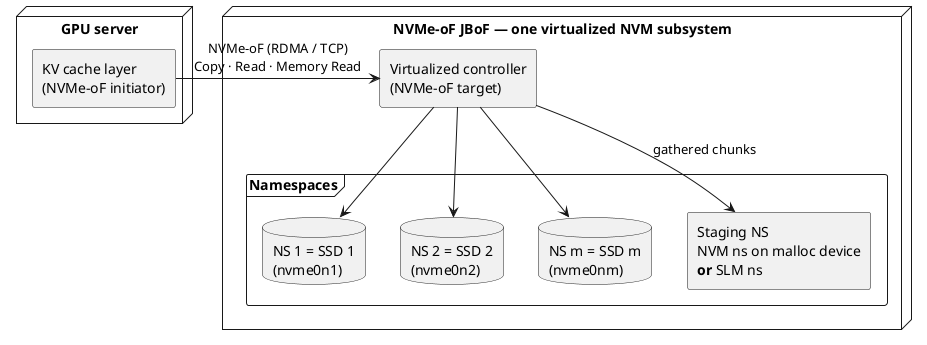
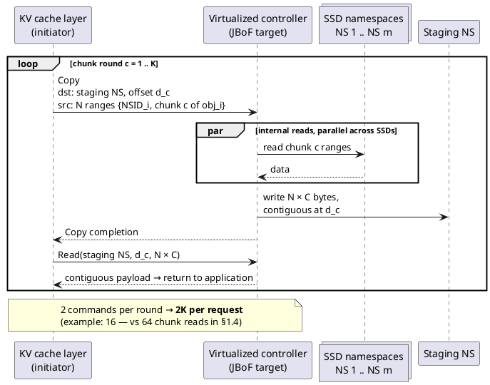
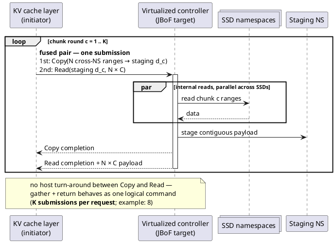
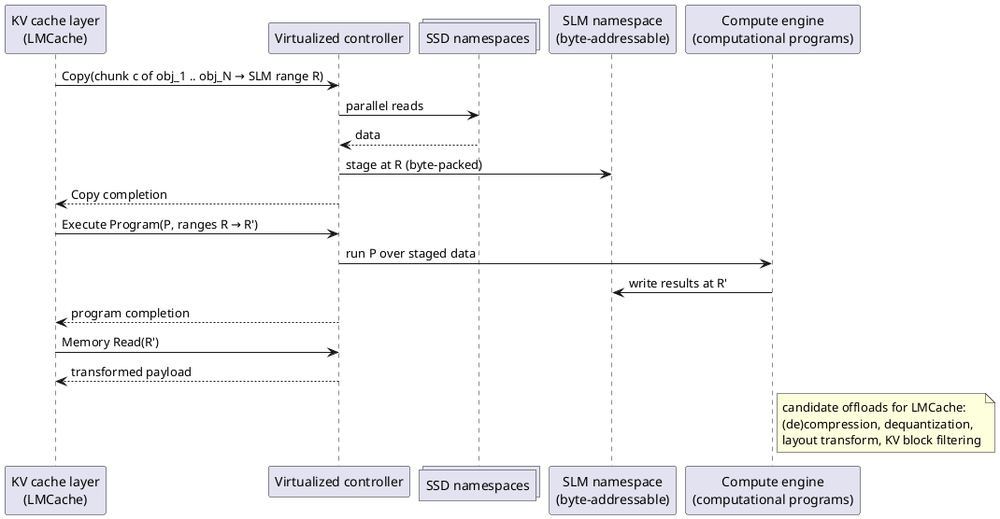
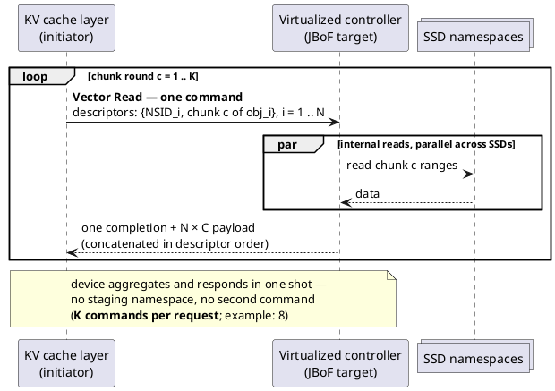

# kvopt — High-Level Design

## §2 Proposed Design — Gather via NVMe Copy and SLM Staging

This section realizes the "gather-read" of §1.5 using **standard NVMe
mechanisms**: the JBoF exposes its SSDs as namespaces of one virtualized NVM
subsystem, and the gather becomes a **cross-namespace Copy** into a staging
namespace, followed by a Read of the contiguous result. A **fused Copy+Read**
(spec proposal) merges the two into one submission, and staging in an **SLM
namespace** opens a path to computational offload for LMCache. Finally, a
**Vector Read** command (§2.7, spec proposal) removes staging entirely for the
pure-gather case: the device aggregates the source ranges itself and returns
the payload in one response.

### 2.1 JBoF as one virtualized NVMe subsystem

The JBoF presents a single NVM subsystem over the fabric. Each physical SSD is
surfaced as one namespace under that subsystem: an initiator that connects sees
`nvme0n1`, `nvme0n2`, …, `nvme0nm`, each mapping to an individual SSD. One
additional namespace serves as the **staging (gather destination) namespace**
(§2.3).

Because every SSD is a namespace of the *same* subsystem, data movement between
them stays inside the JBoF and can be expressed with standard intra-subsystem
NVMe commands — no proprietary gather protocol is needed.

### 2.2 The gather is a cross-namespace Copy

The NVMe Copy command accepts **multiple source ranges**, and with
cross-namespace copy (Copy Descriptor Formats carrying a Source Namespace
Identifier — TP 4130, NVMe 2.1) those sources may live in **different
namespaces** of the subsystem. One chunk round of §1.4 therefore maps to a
single Copy command:

- **Sources:** `N` ranges — chunk `c` of `obj_i` on its SSD namespace, for
  `i = 1 .. N`.
- **Destination:** one contiguous region of the staging namespace.

The cache layer already knows each object's block layout, so it ships the
resolved source-range list inside the Copy command. The JBoF needs **no object
metadata** — it just executes the copy, reading the source ranges in parallel
across SSDs.

After the Copy completes, the cache layer issues one Read against the staging
namespace and receives the `N × C`-byte chunk round as a single contiguous
transfer: **two commands per round — Copy, then Read.**

Spec-level constraints to respect (details in later sections):

- Controller must support the cross-namespace Copy descriptor formats (2h/3h).
- Source and destination namespaces must have compatible formats (for
  block-to-block copy).
- `N` must fit the controller's maximum source range count (MSRC), and chunk
  ranges must respect MSSRL / MCL limits — comfortable for `N = 8`,
  `C = 128 KiB`.

### 2.3 Staging namespace: NVM-on-malloc vs. SLM

Two candidate backings for the staging namespace:

| | **NVM ns on malloc device** | **SLM ns (Subsystem Local Memory)** |
|---|---|---|
| Addressing | block (LBA) | **byte-level** |
| Readback command | standard NVM Read | Memory Read (SLM command set) |
| Spec / ecosystem maturity | works today | newer (TP 4131, computational storage) |
| Usable address range | full namespace LBA space | limited SLM range |
| Packing of gathered data | block-aligned | byte-granular → denser spatial packing |
| Computational offload path | no | **yes** — computational programs (TP 4091) |
| Complexity | low | higher |

The malloc-backed NVM namespace is the simple, standards-complete starting
point. The SLM namespace trades complexity and a constrained address range for
byte-level addressing — better spatial optimization when staged layouts need
not be block-aligned — and, more importantly, it is the on-ramp to
computational offload (§2.6).

### 2.4 Fused Copy+Read: one submission per round (spec proposal)

Copy-then-Read costs a fabric round trip per round: the cache layer must see
the Copy completion before it may submit the Read. NVMe **fused operations**
execute two commands as one atomic unit — but the spec currently defines only
one fused pair, **Compare and Write**.

We propose a **fused Copy+Read pair**: the two commands are submitted together;
the controller executes the Read on the staged region immediately after the
Copy completes, with no host involvement in between. A fused pair still
carries two SQEs, but per round there is **one submission and no
copy-completion round trip** — restoring the single "gather-read" shape of
§1.5.

Command budget across the three schemes:

| Scheme | Per chunk round | Per request (K rounds) | Example (`N=8, K=8`) |
|--------|-----------------|------------------------|----------------------|
| Parallel-partial read (§1.4) | `N` chunk reads | `N × K` | 64 |
| Copy + Read (§2.2) | 1 Copy + 1 Read | `2K` | 16 |
| **Fused Copy+Read (proposal)** | 1 fused submission | `K` | **8** |

### 2.5 Pipeline integration

The application-facing model of §1.4 is unchanged: per chunk round the cache
layer returns chunk `c` of all `N` objects, and computation step `c` overlaps
with the transfer of round `c + 1`. To keep rounds overlapped, consecutive
rounds use distinct staging offsets (`d_1, d_2, …`) in ring fashion, so round
`c + 1`'s Copy can proceed while round `c`'s payload is still being read back.

### 2.6 Beyond gathering: computational offload on SLM

With chunk rounds staged in a **byte-addressable SLM namespace**, the JBoF can
do more than gather. The NVMe computational-programs framework (TP 4091) runs
programs over SLM memory ranges — so transformations that LMCache performs
today on the cache-layer CPU can move next to the data:

This turns the design from a pure gather accelerator into a general
**near-data services layer for the KV cache**: the same staging path serves
plain gathering (Copy [+fused Read]) and value-added processing (Copy →
program → Memory Read).

### 2.7 Further optimization: a Vector Read command (spec proposal)

The staged Copy path of §2.2–§2.4 exists only because today's NVMe Read
returns exactly **one contiguous LBA range** — scattered data must first be
made contiguous somewhere (the staging namespace) before a Read can return it.
The final optimization removes that detour: a new **Vector Read** I/O command.

The command carries a list of source range descriptors `{NSID, SLBA, NLB}` —
mirroring the cross-namespace Copy source descriptors of §2.2. On receiving
it, the device **aggregates the data itself**: it reads all ranges (in
parallel across SSDs), concatenates them in descriptor order, and returns the
whole payload as the command's single data transfer, with a single completion.
No destination namespace is named and none is needed.

Per chunk round, the cache layer issues one Vector Read whose descriptors name
chunk `c` of `obj_1 .. obj_N`, and receives the `N × C`-byte round in one
response:

Compared with fused Copy+Read, Vector Read removes:

- **The staging namespace entirely** — no destination to allocate, no staging
  ring (§2.5), no store-and-forward write + readback pass through a namespace.
  Gathered data is buffered once, transiently, in the controller on its way to
  the host — lower JBoF DRAM bandwidth and lower per-round latency.
- **The second SQE/CQE** — one command and one completion per round, versus
  the fused pair's two of each.

Its costs and positioning:

- A **brand-new I/O opcode** is a heavier NVMe TWG proposal than a new fused
  pair of existing commands; both are proposals, but fused Copy+Read reuses
  established semantics.
- The response is one data transfer, so `N × C` must respect the controller's
  MDTS (1 MiB in the running example — comfortable for typical MDTS values,
  but a real bound on scaling `N`).
- Error reporting must define partial-failure semantics (which descriptor
  failed, whether preceding data is valid).
- **No staged data means no compute hook.** Vector Read is the endpoint for
  *pure gathering*; the Copy → SLM → program path (§2.6) remains the vehicle
  for computational offload. The two are complementary — a deployment can use
  Vector Read for plain gathers and SLM staging when near-data processing is
  wanted.

The full optimization ladder:

| Scheme | Per chunk round | Staging pass in JBoF DRAM | Per request (K rounds) | Example (`N=8, K=8`) |
|--------|-----------------|---------------------------|------------------------|----------------------|
| Parallel-partial read (§1.4) | `N` chunk reads | none | `N × K` | 64 |
| Copy + Read (§2.2) | 1 Copy + 1 Read | write + readback | `2K` | 16 |
| Fused Copy+Read (§2.4) | 1 submission (2 SQEs) | write + readback | `K` | 8 |
| **Vector Read (§2.7)** | **1 command** | **none — direct return** | `K` | **8** |

### 2.8 Open issues

1. **Store-and-forward cost** — staging adds a write + readback pass through
   JBoF DRAM per round; quantify added latency/memory bandwidth vs. the saved
   command and round-trip overhead.
2. **Target support** — cross-namespace Copy (formats 2h/3h) and SLM support in
   the target software (e.g., SPDK NVMe-oF target); gap analysis needed.
3. **Staging management** — sizing the ring of staging regions for in-flight
   rounds × concurrent application requests; allocation/arbitration policy,
   especially under SLM's limited address range.
4. **Fused Copy+Read semantics** — proposal must define atomicity, ordering,
   and error behavior (e.g., the Read half must abort if the Copy fails);
   engagement path with the NVMe technical working group.
5. **Failure/partial-completion semantics** — behavior when one SSD-range read
   of a round is slow or fails (carried over from §1.7).
6. **Interference/QoS** — Copy-generated internal reads compete with other
   traffic to the SSD namespaces.
7. **Vector Read proposal specifics** — descriptor-count limit, `N × C` vs.
   MDTS, partial-failure reporting; and standards strategy: pursue fused
   Copy+Read and Vector Read as one staged TWG engagement (fused pair first,
   Vector Read as the follow-on) or as independent proposals.
