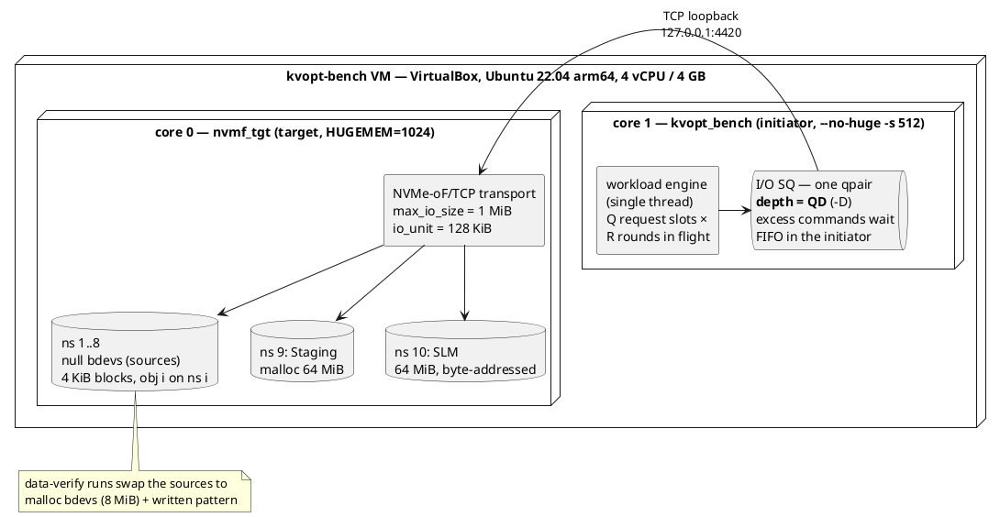
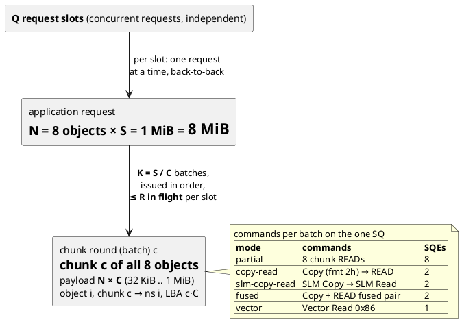
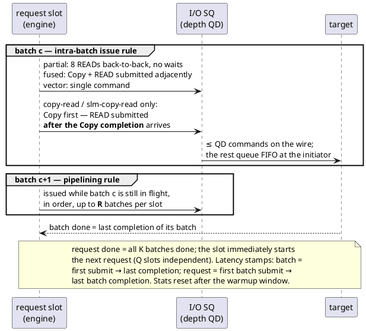
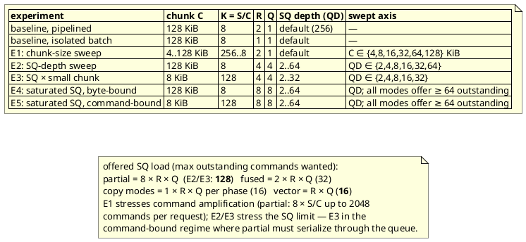

# kvopt — High-Level Design

## §3 Evaluation Setup (VM protocol-overhead benchmark)

All experiments run on a single VM (protocol overhead only — null-bdev
sources, TCP loopback), using `app/kvopt_bench` from the `kvopt` branch.
This section records how each experiment was executed.

### 3.1 Harness topology

One initiator process and one target process share the VM, pinned to
separate cores. The benchmark app uses a single thread and a single I/O
qpair whose size (`-D`) models the device submission-queue depth limit.

### 3.2 Workload decomposition

One *application request* fetches N = 8 objects of S = 1 MiB each
(8 MiB per request, all modes, all experiments). A request is served as
K = S / C *chunk rounds* ("batches"); batch `c` fetches chunk `c`
(C bytes) of all 8 objects — payload N × C per batch.

### 3.3 Command-issue rules

### 3.4 Experiment matrix

Common: N = 8 objects, 4 KiB blocks, request = 8 MiB, single qpair,
10 s measurement + 2 s warmup per point, target 1 core / initiator
1 core, zero data errors accepted.

Result CSVs: `results/kvopt-vm-loopback-*.csv` (baselines),
`results/kvopt-vm-chunk-sweep-*.csv` (E1), `results/kvopt-vm-qd-sweep-*.csv`
(E2), `results/kvopt-vm-qd-c8k-sweep-*.csv` (E3), `results/kvopt-vm-qdsat-*.csv` (E4/E5). Scripts:
`test/kvopt/run_benchmark.sh`, `sweep_chunk.sh`, `sweep_qd.sh` in the
`kvopt` SPDK branch.
